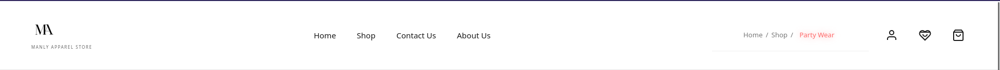
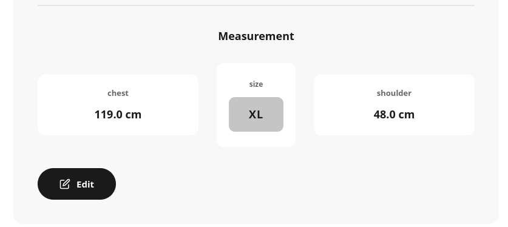
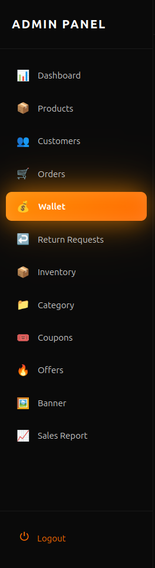

<div align="center">


<p align="center">
  
</p>

<p>
  
  
  
  
  
</p>

**[Live Demo](#) • [Documentation](#installation--setup) • [Features](#core-features)**

</div>

---

## 🎯 The Story Behind MANLY

**The problem was simple, yet universal:**

Every man has experienced it — ordering clothes online, unsure if they'll fit. Standard sizing (S, M, L, XL) is a guessing game. You order an XL shirt, and it's either too tight in the shoulders or too loose in the chest. Returns pile up. Frustration builds. Shopping becomes a chore.

**Generic sizing doesn't work because bodies aren't generic.**

MANLY was built to solve this fundamental disconnect between how clothes are sold and how bodies are shaped. By capturing your actual measurements — chest, shoulder, waist — and mapping them to products, MANLY eliminates guesswork. You see only what fits *you*.

**This isn't just another e-commerce store. It's a fit-first shopping experience.**

Clean UI. Smart recommendations. Secure payments. Real business logic. MANLY represents what modern online retail should be — personal, efficient, and trustworthy.

---

## 🖼️ Interface & Experience

### **Home – First Impressions Matter**

<div align="center">

<p><i>Clean navigation, category-driven browsing, and immediate clarity</i></p>
</div>

The homepage sets the tone: minimal clutter, maximum focus. Users land on clear categories (Formal, Casual, Party, Beach Wear) with intuitive navigation to Shop, Contact, and About sections.

---

### **Product Discovery – Filter by What Matters**

<div align="center">

<p><i>Category-based filtering, size selection, and price range controls</i></p>
</div>

**Key Features:**
- **Category Filtering:** Formal, Casual, Party, Beach Wear
- **Size Filtering:** Only show products available in your size
- **Price Range:** Set min/max budgets
- **Visual Clarity:** High-quality product images with pricing

The "Shopping for someone else" toggle allows gift shopping without measurement constraints.

---

### **Intelligent Sizing – The Core Innovation**

<div align="center">


<p><i>Chest, shoulder, and size mapping for personalized recommendations</i></p>
</div>

**How it works:**
1. User enters chest and shoulder measurements
2. System maps measurements to standard sizes (S, M, L, XL, XXL)
3. Product catalog auto-filters to only show compatible items
4. Users see "Edit" option to update measurements anytime

**Why this matters:**  
Traditional e-commerce shows everything. MANLY shows only what fits. This reduces returns, increases satisfaction, and builds trust.

---

### **Admin Dashboard – Business Control Center**

<div align="center">


<p><i>Comprehensive admin panel with wallet management, inventory, and reports</i></p>
</div>

**Admin Capabilities:**
- **Dashboard:** Sales overview, metrics
- **Products:** Add, edit, delete items
- **Customers:** User management
- **Orders:** Track, update, fulfill
- **Wallet:** Manage customer balances (refunds, credits)
- **Inventory:** Stock tracking
- **Coupons & Offers:** Promotional campaigns
- **Sales Reports:** Export data for analysis

Built for real business operations, not just demo purposes.

---

## ⚡ Core Features

<div align="center">

| 🔐 **Authentication** | 📏 **Smart Sizing** | 🛒 **Shopping** | 💳 **Payments** |
|:---:|:---:|:---:|:---:|
| Email + Google OAuth | Measurement-based filtering | Cart with stock validation | Razorpay integration |
| Secure sessions | Size recommendations | Wishlist functionality | Wallet system |
| Role-based access | Profile management | Coupon application | COD option |

| 🔄 **Returns** | 📊 **Admin** | 🎯 **UX** | 🛡️ **Security** |
|:---:|:---:|:---:|:---:|
| Automated refunds | Full dashboard | Clean, minimal design | Django authentication |
| Wallet credits | Inventory management | Mobile responsive | Encrypted payments |
| Return tracking | Sales analytics | Fast load times | Data validation |

</div>

---

## 🛠️ Tech Stack

<div align="center">


</div>

<table align="center">
<tr>
<td align="center" width="25%">

### **Backend**
  


Full-stack framework with MVT architecture

</td>
<td align="center" width="25%">

### **Database**


Relational database with complex queries

</td>
<td align="center" width="25%">

### **Frontend**

  


Modern UI with utility-first CSS

</td>
<td align="center" width="25%">

### **Payments**


Secure payment gateway integration

</td>
</tr>
</table>

---

## 🏗️ System Design Highlights

### **Why Django?**
Django provides the right balance of rapid development and production-grade features. Built-in ORM, admin interface, and authentication allowed focus on business logic rather than boilerplate.

### **Custom User Model**
Extended Django's `AbstractUser` to include measurement fields (chest, shoulder, calculated size). This allows size-based filtering at the database query level.

### **Order Snapshot Architecture**
Orders store product details at time of purchase, not foreign keys. If a product is edited or deleted, historical orders remain accurate. This is critical for accounting and customer service.

### **Wallet-Based Refund System**
Returns credit user wallets instead of reversing payment gateway transactions. This reduces processing time, keeps customers in the ecosystem, and simplifies accounting.

### **Role Separation**
Admins and customers use different URL namespaces and templates. Admins cannot accidentally place orders; customers cannot access inventory management. Clean separation of concerns.

---

## 📦 Installation & Setup

### **Prerequisites**
```bash
Python 3.8+
PostgreSQL 12+
pip (Python package manager)
Razorpay account (for payments)
```

### **Clone Repository**
```bash
git clone https://github.com/arjunj20/manly-apparel.git
cd manly-apparel
```

### **Create Virtual Environment**
```bash
python -m venv venv

# Windows
venv\Scripts\activate

# macOS/Linux
source venv/bin/activate
```

### **Install Dependencies**
```bash
pip install -r requirements.txt
```

### **Configure Environment Variables**
Create a `.env` file in the root directory:
```env
SECRET_KEY=your-django-secret-key
DEBUG=True
DATABASE_NAME=manly_db
DATABASE_USER=your_db_user
DATABASE_PASSWORD=your_db_password
DATABASE_HOST=localhost
DATABASE_PORT=5432

RAZORPAY_KEY_ID=your_razorpay_key
RAZORPAY_KEY_SECRET=your_razorpay_secret

EMAIL_HOST=smtp.gmail.com
EMAIL_PORT=587
EMAIL_HOST_USER=your_email@gmail.com
EMAIL_HOST_PASSWORD=your_app_password
```

### **Database Setup**
```bash
# Create PostgreSQL database
createdb manly_db

# Run migrations
python manage.py makemigrations
python manage.py migrate
```

### **Create Superuser**
```bash
python manage.py createsuperuser
```

### **Load Sample Data (Optional)**
```bash
python manage.py loaddata fixtures/sample_products.json
```

### **Run Development Server**
```bash
python manage.py runserver
```

🌐 **Access:** `http://127.0.0.1:8000/`  
🔧 **Admin:** `http://127.0.0.1:8000/adminpanel/`

---

## 📁 Project Structure
```
manly_project/
│
├── apps/
│   ├── accounts/          # User authentication & profiles
│   ├── products/          # Product catalog & management
│   ├── cart/              # Shopping cart logic
│   ├── orders/            # Order processing & tracking
│   ├── wallet/            # Wallet & refund system
│   ├── coupons/           # Discount & coupon engine
│   ├── offers/            # Promotional offers
│   ├── adminpanel/        # Admin dashboard
│   ├── wishlist/          # Wishlist functionality
│   ├── reviews/           # Product reviews
│   └── sizeguide/         # Size recommendation logic
│
├── manly_project/         # Project settings & URLs
├── templates/             # HTML templates
├── static/                # CSS, JS, images
├── media/                 # User-uploaded content
├── requirements.txt       # Python dependencies
└── manage.py              # Django CLI
```

---

## 🚀 Future Improvements

### **Phase 1: Intelligence**
- **AI-Powered Recommendations:** Machine learning to suggest products based on browsing history
- **Dynamic Pricing:** Competitive pricing based on market trends
- **Virtual Try-On:** AR integration for size visualization

### **Phase 2: Scale**
- **Mobile Application:** Native iOS/Android apps
- **Multi-Vendor Support:** Allow third-party sellers
- **International Shipping:** Expand beyond local markets

### **Phase 3: Optimization**
- **CDN Integration:** Faster image loading
- **Redis Caching:** Reduce database queries
- **ElasticSearch:** Advanced product search

---

## 👤 Author

<div align="center">

### **Rithu Raj R**

Full-Stack Developer | Django Specialist | Product Builder

[](https://github.com/rithuraj6)
[](https://www.linkedin.com/in/rithurajr/)

*Built with Django and attention to real-world commerce needs*

</div>

---

## 📄 License

This project is licensed under the **MIT License** - see the [LICENSE](LICENSE) file for details.

---

<div align="center">


### ⭐ If this project helped you, consider giving it a star

**MANLY – Where fit meets function**

</div>
